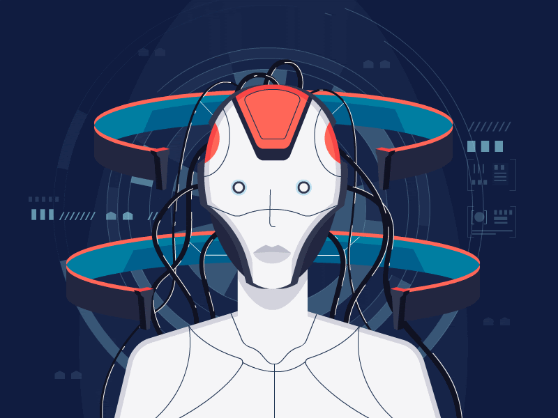

<h1 align="center">Hi 👋, I'm Isuru Jinasena</h1>
<h3 align="center">AI/ML enthusiast</h3>
 
<section>

<!-- 
  
 -->
 

- Undergraduate in **Computer Science**
- Interested in **IoT, Data Science, Machine Learning, Cloud Computing and Robotics**
- Love to build **AI-based robots**
- Creative thinker, team player, quick learner
- Passionate gamer
- Like pizza and coffee

</section>
 
<h3 align="left">Connect with me:</h3>

<h3 align="left">Languages and Tools:</h3>

 

 
 

 
</a> 

 

 

